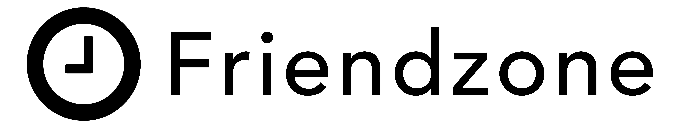
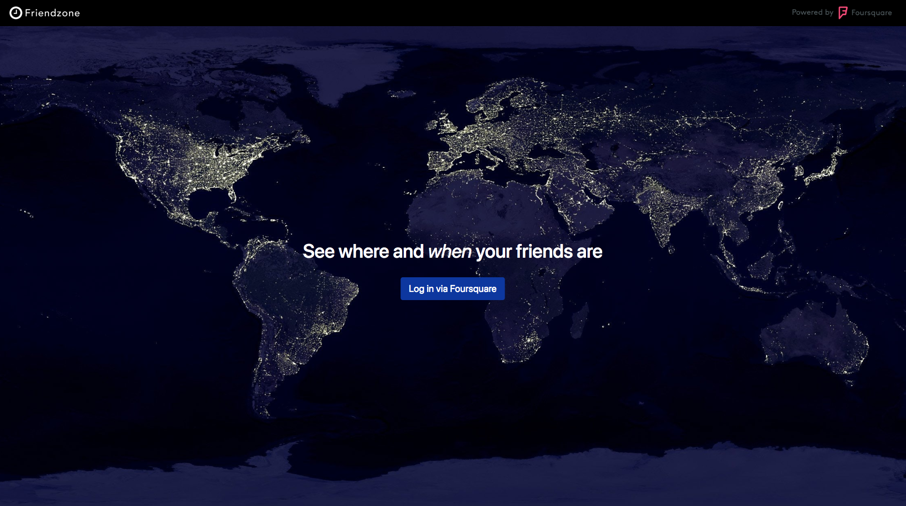
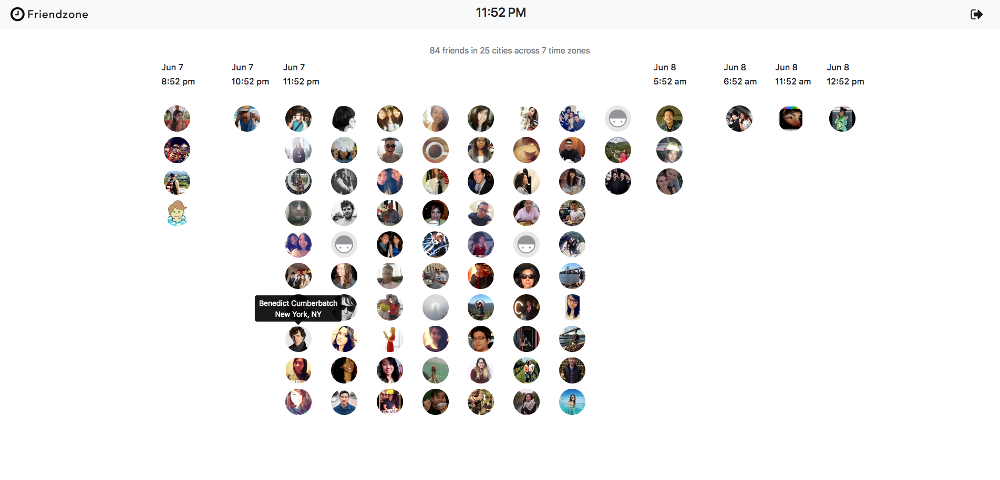

### *Friendzone* is an app that lets you see your Foursquare friends' location and local time based on their time zone.

## Built with:
* Ruby on Rails
* PostgreSQL
* [Foursquare Places API](https://developer.foursquare.com/places-api)
* [Google Geocoding API](https://developers.google.com/maps/documentation/geocoding/intro)
* [Google Time Zone API](https://developers.google.com/maps/documentation/timezone/intro)

## Description
The app uses the Google Geocoding API to obtain a user's coordinates and the Time Zone API to get their Time Zone ID (defined by [Unicode Common Locale Data Repository (CLDR) project](http://cldr.unicode.org/)). Finally, the TZInfo gem is used to determine the current local time with the Time Zone ID.

## Usage Instructions
Users need to log in using their Foursquare accounts. Once authorized, the app will import the user's and their friends' data from Foursquare in order to display their home cities and local time.

## Screenshots

Home page when not logged in:

Friends in various time zones, shows name and location when hovered:

## Future
Currently, the app uses a static attribute (home city) from Foursquare's user data, instead of dynamic location data (check ins), which requires each individual user's authorization. Dynamic location display is currently being implemented, along with a mobile app using React Native.

## Acknowledgement

### Design Inspiration:
* [timezone.io](https://timezone.io/)
